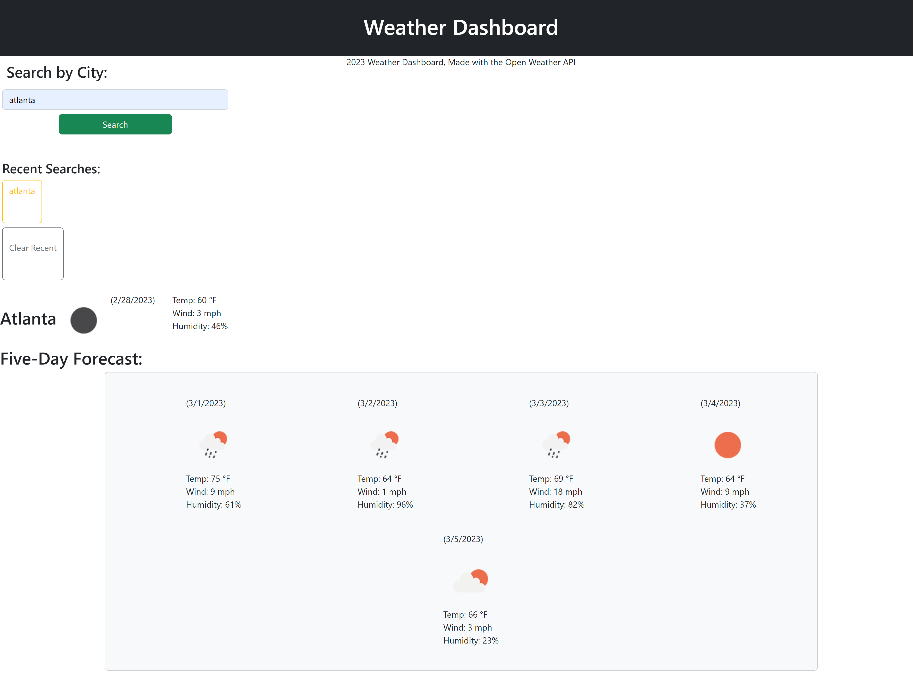

# Another API Weather Dashboard

User Story
AS A traveler
I WANT to see the weather outlook for multiple cities
SO THAT I can plan a trip accordingly

Acceptance Criteria
GIVEN a weather dashboard with form inputs
WHEN I search for a city
THEN I am presented with current and future conditions for that city and that city is added to the search history
WHEN I view current weather conditions for that city
THEN I am presented with the city name, the date, an icon representation of weather conditions, the temperature, the humidity, and the the wind speed
WHEN I view future weather conditions for that city
THEN I am presented with a 5-day forecast that displays the date, an icon representation of weather conditions, the temperature, the wind speed, and the humidity
WHEN I click on a city in the search history
THEN I am again presented with current and future conditions for that city

## Description
This is a weather forecast application based on the OpenWeather API -- 
It's an easy and simple to use tool that can be used to look up the most up to date and need-to-know weather information for any given day and upcoming week based on the city.

Using Bootstrap framework, Jquery, and the Open weather API the user can search for a city and get the current and future weather conditions which include the respective date(s), temperature, humidity, wind speed and UVIndex for each city. The forecast will also display corresponding weather icons. Local storage will store data for previously search cities and add them to a list which can be clicked to reload city search.

## Table of Contents

- [Description](#description)
- [Installation](#installation)
- [Usage](#usage)
- [Deployment](#deployment)
- [Technologies](#technologies)
- [Credits](#credits)
- [License](#license)
- [Tests](#tests)

## Installation

No installation required -- this is a web-based application.

## Usage - Instructions / How To Use

Enter a city name in the search bar and click the Search button. By doing so, the application will generate the current weather for that city as well as a five-day forecast. 

Your recent searches will be saved as a button in the search history side bar, and you can simply click on them to view a recent city search. 

Provide instructions and examples for use. Include screenshots as needed.

To add a screenshot, create an `assets/images` folder in your repository and upload your screenshot to it. Then, using the relative file path, add it to your README using the following syntax:

## Deployment
Live URL: <a href="https://blairrrrwho.github.io/another-api-weather-dashboard/">Weather Dashboard API Application</a>

<!-- in the parentheses is just the relative path to the screenshot-->

## Technologies
HTML, CSS, JavaScript, Bootstrap, API calls

Weather Data Api: https://openweathermap.org/

Geological Api: https://openweathermap.org/

## Credits

OpenWeather API Website: https://openweathermap.org/forecast5
Bootstrap: https://getbootstrap.com/docs/5.2/getting-started/introduction/

I'd like to thank my classmates and Jacob Nordan. 

## License

This project is licensed under the MIT license. For more information about this license and what it entails visit: https://opensource.org/licenses/MIT

## Tests

There are tests currently active for this project.

